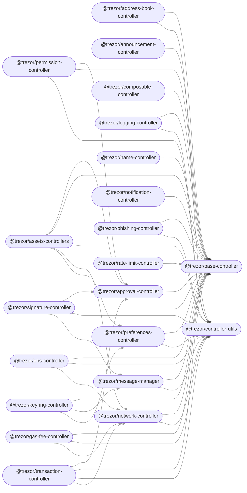

  

<!-- Nothing weird to see here -->

  <a href="https://readme.andyruwruw.com/api/now-playing?open">
    <!-- Music bars move to the beat and are colored based on the track's happiness, danceability and energy! -->
    
    <!-- This is how you'd make the call dynamically  -->
  </a>

# Security features

  * symmetric password encryption key never leaves the Trezor
  * button confirmation on Trezor is required to activate decryption of a password 
  * upon requesting password decryption, user sees on Trezor's display decryption
    of which password group is requested before confirmation
  * backup/export of passwords possible, also requires explicit button confirmation
  * if Trezor is lost, recovery from seed on a new Trezor and using the same
    password will also recover encrypted password database (in theory recovery
    can be done without Trezor, but such script is not yet written)

# How backup works

Each password is encrypted and stored twice. Once with symmetric AES-CBC function
of Trezor that always requires button confirmation on device to decrypt. Second
encryption is done to public RSA key, whose private counterpart is encrypted
with Trezor. Backup requires private RSA to be decrypted and then used to decrypt
the passwords.

## Storage format

Entries fall into three categories:

| Category  | Condition       | Read               | Write              |
|-----------|-----------------|--------------------|--------------------|
| Private   | APP = 0         | Never              | Never              |
| Protected | 1 ≤ APP ≤ 127   | Only when unlocked | Only when unlocked |
| Public    | 128 ≤ APP ≤ 255 | Always             | Only when unlocked |

The format of public entries has remained unchanged, that is:

| Data           | KEY | APP | LEN | DATA |
|----------------|-----|-----|-----|------|
| Length (bytes) | 1   | 1   | 2   | LEN  |

Private values are used to store storage-specific information and cannot be directly accessed through the storage interface. Protected entries have the following new format:

| Data           | KEY | APP | LEN | IV | TAG | ENCRDATA |
|----------------|-----|-----|-----|----|-----|----------|
| Length (bytes) | 1   | 1   | 2   | 12 | 16  | LEN - 28 |

### Backers

## Contributing

Contributions are welcome, but please follow these contributor guidelines outlined in [CONTRIBUTING.md](CONTRIBUTING.md).

## License

metamask is licensed under a [BSD 2-Clause License](LICENSE.md) and is copyright [Intoli, LLC](https://intoli.com).

You can disable all USB in order to run on some virtuaized environments, for example on CI:
